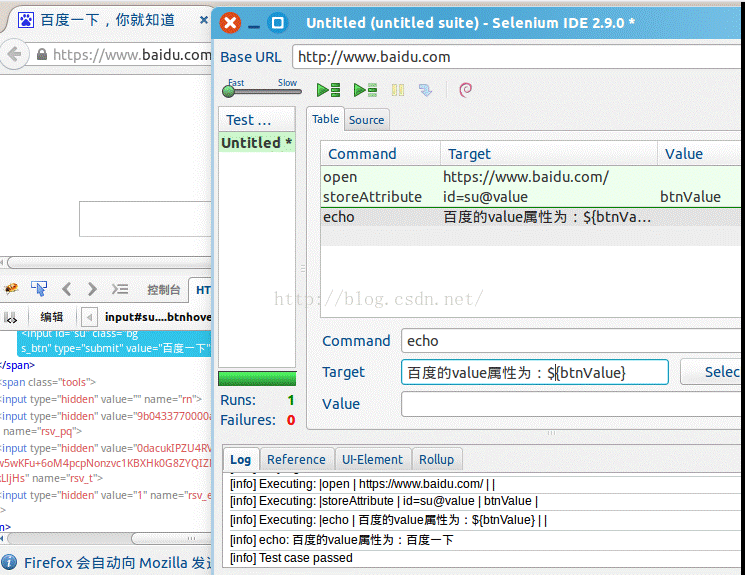
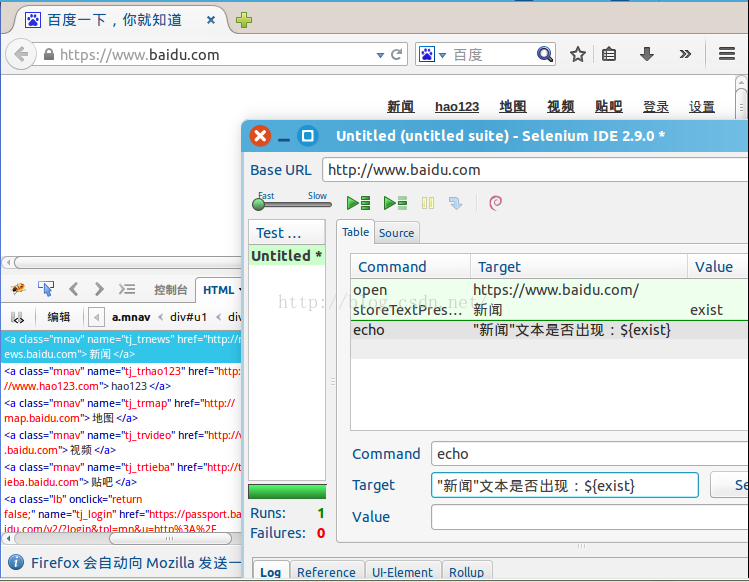

# selenium IDE的基础知识--Accessors命令 

* **store(expression,variableName)**

  （1）作用：将指定的值存储在变量中；

  （2）Target--要存储的值；

  （3）Value--变量名称，即值存放的地方；

* **storeTitle(variableName)**

  （1）作用：获取当前页面的标题；

  （2）对应方法：getTitle()方法；

* **storeLocation(variableName)**

  （1）作用：获取当前页面的绝对URL；

  （2）对应方法：getLocation()方法；

* **storeValue(locator,variableName)**

  （1）作用：获取某个input元素值，对于radio或checkbox，按其选中与否，输出on或off；

  （2）variableName：该信息存放的变量名；

  （3）对应方法：getValue()方法；

  （4）注：在获取时，去除前后空格，否则均按一个处理；

* **storeEditable(locator,variableName)**

  （1）作用：用于存储input元素的可编辑状态，如文本框、复选框、单选框的可编辑状态；若可以编辑，则返回true，否则返回false；
  locator：指向某个可输入元素的元素定位器；

  （2）对应方法：isEditable()方法；

* **storeText(locator,variableName)**

  （1）作用：获取某个元素的文本值（如链接、纯文本等）；

  （2）对应方法：getText()方法；

* **storeChecked(locator,variableName)**

  （1）作用：获取一个按钮是否被选中；

  （2）对应方法：isChecked()方法；

  （3）注：若被选择元素不是一个radio或者checkbox，该方法将失败；

* **storeSelectedIndex(selectLocator,variableName)  /  storeSelectedIndexs(selectLocator , variableName)**

  （1）作用：获取所选项在列表中的索引（从0开始）；

  （2）对应方法：getSelectedIndex()方法；

* **storeSelectedValue(selectLocator,variableName) / storeSelectedValues(selectLocator , variableName)**

  （1）作用：获取指定选择元素/多选元素被选择的选项的值；

  （2）对应方法：getSelectedValue()方法；

* **storeSelectOptions(selectLocator,variableName)**

  （1）作用：获取指定选择元素的所有选项的文本，以逗号分隔；

  （2）selectLocator：指向指定选择元素的选择器；

  （3）对应方法：getSelectOptions()方法；

* **storeTable(tableCellAddress,variableName)**

  （1）作用：获取表中某个单元内的文本值；

  （2）tableCellAddress：指向指定表中元素的选择器，格式为：tableLocator.row.column；

  （3）Target-形式为“表格的定位表达式.行号.列号”，如“foo.1.4”，foo代表表格的ID和Name；

  （4）对应方法：getTable()方法； 

**注： 表格的行和列是第0行，第0列开始的**

* **storeAttribute(attributeLocator,variableName)**

  （1）作用：获取指定的属性值；

  （2）Target-形式为“属性的定位表达式”，格式为“元素定位表达式 + @属性名称”，如“foo@bar”；

  （4）对应方法：getTable()方法； 

  如：要获得“百度一下”的value属性，如下：

* **storeTextPresent(pattern,variableName)**

  （1）作用：验证指定的文本是否在页面中出现；

  （2）pattern：指定文本；

  （3）对应方法：isTextPresent()方法；

  如：验证百度首页是否出现“新闻”的文本，示例如下：

* **storeElementPresent(locator,variableName)**

  （1）作用：验证页面上是否有指定元素，如果是，则返回true，否则返回false；

  （2）对应方法：isElementPresent()方法；

* **storeVisible(locator,variableName)**

  （1）作用：获得指定元素是否可见；

  （2）对应方法：getVisible()方法； 

  （3）有时会碰上，即使在页面上看不到某个元素，但是用storeElementPresent命令验证时，仍返回true，是因为这个元素仍在HTML代码中，只是没显示出来；

* **storeSpeed(variableName)**

  （1）作用：获取执行速度，获取的是每个测试步骤之间的执行间隔时间（默认为0，单位为ms）；

* **storeAllWindows(variableName)**

  （1）作用：以数组的形式返回所有页面的ID；

  （2）对应方法：getAllWindows()方法；

* **storeAllWindowNames(variableName)**

  （1）作用：以数组的形式返回所有页面的name；

  （2）对应方法：getAiiWindowNames()；

* **storeAllWindowTitles(variableName)**

  （1）作用：以数组的形式返回所有的页面标题；

  （2）对应方法：getAllWindowTitles()方法；

* **storeSomethingSelected(selectLocator,variableName)**

  （1）作用：获取指定元素是否有选择项；

  （2）对应方法：isSomethingSelected()方法；

* **storeSelectedld(selectLocator,variableName)/storeSelectedlds(selectLocator,variableName)**

  （1）作用：获取指定选择元素/多选元素的被选择的选项ID；

  （2）对应方法：getSelectedId()方法；

* **storeSelectedLabel(selectLocator,variableName) / storeSelectedLabels(selectLocator , variableName)**

  （1）作用：指向指定选择元素的选择器；

  （1）对应方法：getSelectedLabel()方法；

* **storeAlert(variableName)**

  （1）作用：返回一个由于前一个动作产生的alert对话框信息；

  （2）对应方法：getAlert()方法；

  ***注：在获得这个alert时，默认手动单击了确定按钮；在selenium中，不会弹出可见的alert；***

* **storeConfirmmation(variableName)**

  （1） 作用：返回因一个动作产生的带确认和取消选择的弹出窗口；

  （2）对应方法：getConfirmmation()方法；

  ***注：在获得这个confirm时，默认手动单击了确定按钮；在selenium中，不会弹出可见的confirm；***

* **storePrompt(variableName)**

  （1）作用：返回因一个动作产生的带可输入信息的弹出窗口；

  （2） 对应方法：getPrompt()方法；

  ***注：在获得这个prompt时，默认手动单击了确定按钮；在selenium中，不会弹出可见的prompt；如果前一个动作产生了一个prompt，而没获得或验证，则下一个动作将出现错误；***

* **storeAllButton(variableName)**

  （1）作用：以数组形式返回页面上所有按钮的ID；

  （2）对应方法：getAllButtons()方法；

* **storeAllFields(variableName)**

  （1）作用：以数组的形式返回页面上所有可输入域的ID；

  （1）对应方法：getAllFields()方法；

* **storeAllLinks(variableName)**
  
  （1）作用：以数组形式返回页面上的链接ID；

  （2）对应方法：getAllLinks()方法；

* **storeBodyText(variableName)**

  （1）作用：返回页面上的所有的文本信息；

  （2）对应方法：getBodyText()方法；

* **storeHtmlSource(variableName)**
* 
  （1）作用：返回页面所有源代码；

  （2）对应方法：getHtmlSource()方法；

* **storeCookie(variableName)**

  （1）作用：获得当前页面下的所有Cookie；

  （1）对应方法：getCookie()方法；

* **storeElementHeight(locator,variableName)**

  （1）作用：返回指定元素的高度；

  （2）对应方法：getElementHeight()方法；

* **storeElementPositionLeft(locator,variableName)**

  （1）作用：返回指定元素的水平位置；

  （2）对应方法：getElementPositionLeft()方法；

* **storeMouseSpeed(variableName)**

  （1）作用：获得鼠标移动速度，默认为10；

  （2）对应方法：getMouseSpeed()方法；

* **storeXpathCount(xpath,variableName)**

  （1）作用：获得匹配指定Xpath的元素个数；

  （2）xpath：指定匹配的Xpath；

  （2）对应方法：getXpathCount()方法；
