# 前言：

（1）主要验证某个命题是否为真，例如“该元素是否存在"或”该元素的某个属性是否为XXX“。  
（2）所有的Assertion命令都可通过3中模式使用：assert、vertify和waitFor。区别在于如果assert失败，测试则会中断；而vertify失败时，失败将记录下来，但是测试仍继续执行。因此建议用单个assert来确认当前应用程序是否位于正确的页面，然后接下来使用一系列vertify命令来测试表单字段的值、标签值等。  
（3）而waitFor命令用于执行等待，直到等待的条件为真（非常适合测试Ajax应用程序）。若等待的条件为真，那么测试通过；若等待时间超过
当前的超时时间设置（超时时间由setTimeOut命令设置，默认为30s），等待的条件仍为假，则测试将会失败并终止。  

## 1.assertTitle(pattern) / assertNotTitle(pattern) / verifyTitle(pattern) / verifyNotTitle(pattern) / waitForTitle(pattern) / waitForNotTitle(pattern)

    （1）作用：验证网页的标题是否等于或不等于预期值；

    （2）Target-用于对比的预期值；

   如：验证标题是否为”百度一下，你就知道“：

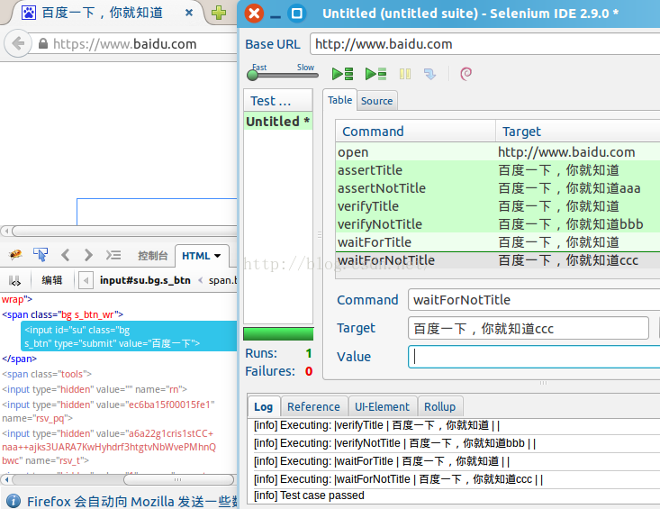

## 2.assertLocation(pattern) / assertNotLocation(pattern) / verifyLocation(pattern) / verifyNotLocation(pattern) / waitForLocation(pattern) / waitForNotLocation(pattern)
    （1）作用：验证网页的URL是否等于或不等于预期值；

  如：验证在浏览器打开”http://tieba.baidu.com“页面时，页面是否会自动跳转到“http://tieba.baidu.com/index.html”：

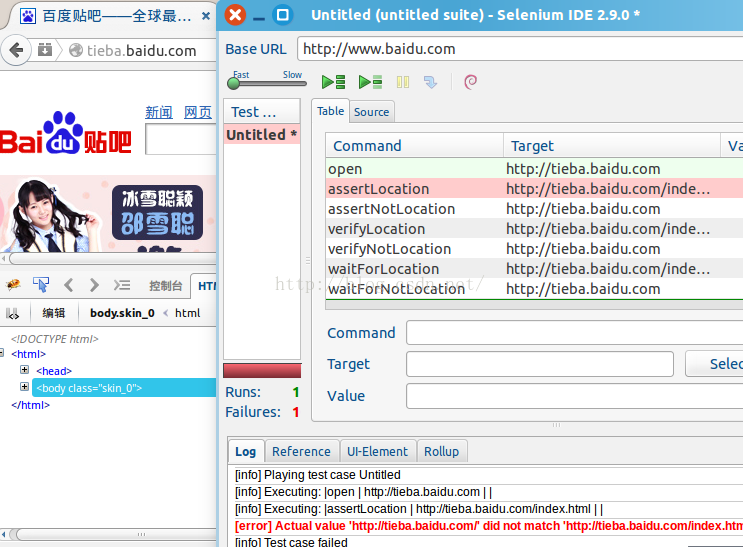

## 3.assertVaue ( locator , pattern ) / assertNotValue ( locator , pattern ) / verifyValue ( locator , pattern ) / verifyNotValue ( locator , pattern ) / waitForValue ( locator , pattern ) / waitForNotValue ( locator , pattern )
    （1）作用：验证input元素的值是否等于或不等于预期值；

    （2）对例如文本框、复选框、单选框中的值（即这些元素的value属性）是否等于或不等于预期值；对于复选框或单选框，预期值应填写“on”（表示已勾选）或“off”（表示未勾选）；

    （3）Target-元素的定位表达式；

        Value-用于对比的预期值；

  如：打开百度首页，在搜索框内输入“selenium”，检测预期值是刚输入的“selenium”，而不是空值：

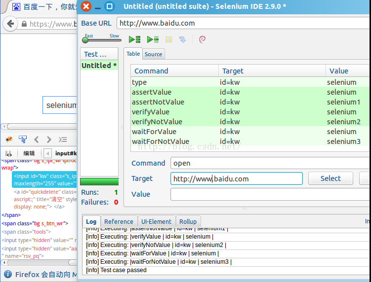

## 4.assertEditable ( locator ) / assertNotEditable ( locator ) / verifyEditable ( locator ) / verifyNotEditable ( locator ) / waitForEditable ( locator ) / waitForNotEditable ( locator )

     （1）作用：验证input元素的可编辑状态是否为预期状态；

  如：打开百度首页，验证文本框是否为可编辑状态（由于该页面没有处于不可编辑的input元素，所以没对NotEditable系列命令进行测试）：

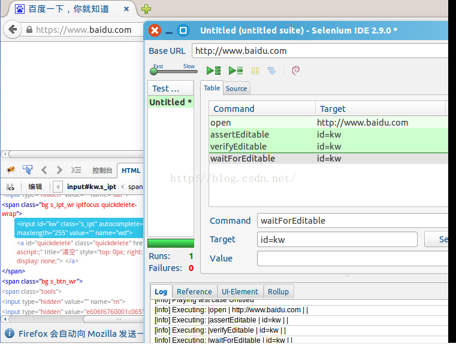

## 5.assertText ( locator , pattern ) / assertNotText ( locator , pattern ) / verifyText ( locator , pattern ) / verifyNotText ( locator , pattern ) / waitForText ( locator , pattern ) / waitForNotText ( locator , pattern )
     （1）作用：验证某个元素的文本值是否等于预期值；
 
     （2）Target-元素的定位表达式；

     （3） Value-用于对比的预期值；

  如：验证百度首页的“视频”的链接的文本是否为“视频”：

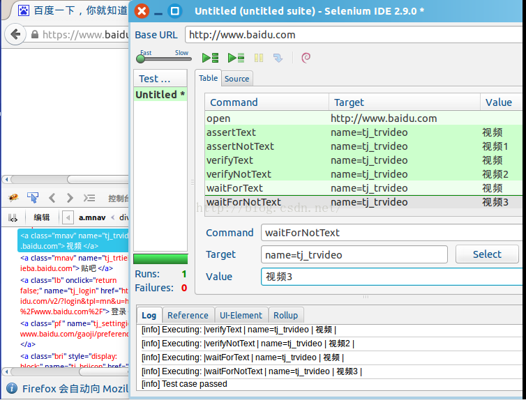

## 6.assertChecked ( locator ) / assertNotChecked ( locator ) / verifyChecked ( locator ) / verifyNotChecked ( locator ) / waitForChecked ( locator ) / waitForNotChecked ( locator )

    （1）作用：验证复选框或单选框的勾选情况是否符合预期；

    （2）Target-元素的定位表达式；

#  7.assertSelectedIndex ( selectLocator , pattern ) / assertNotSelectedIndex ( selectLocator , pattern ) / verifySelectedIndex ( selectLocator , pattern ) / verifyNotSelectedIndex ( selectLocator , pattern ) / waitForSelectedIndex ( selectLocator , pattern ) / waitForNotSelectedIndex ( selectLocator , pattern ) 

    （1）作用：验证所选项在列表中的索引是否符合预期值（从0开始）；

    （2）Target-列表的定位表达式；

    （3）Value-用于对比的预期值；

  如：百度贴吧高级搜索中，验证“搜索结果排序方式”的“按时间顺序”的selectedIndex是否为1：

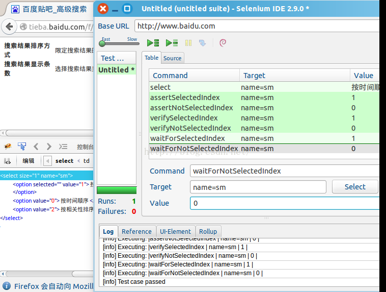

## 8.assertSelectedLabel ( selectLocator , pattern ) / assertNotSelectedLabel ( selectLocator , pattern ) / verifySelectedLabel ( selectLocator , pattern ) / verifyNotSelectedLabel ( selectLocator , pattern ) / waitForSelectedLabel ( selectLocator , pattern ) / waitForNotSelectedLabel ( selectLocator , pattern )

    （1）作用：验证指定列表中所选项的文本值是否符合预期值；

    （2）Target-列表的定位表达式；

    （3）Value-用于对比的预期值；

  如：百度贴吧高级搜索中，选择“按相关性排序”，验证其selectedLabel是否为“按相关性排序”：

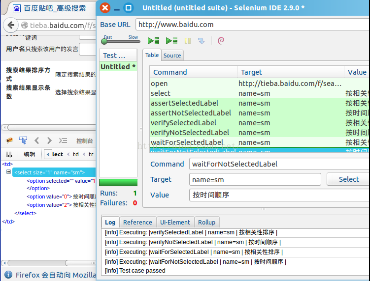

# 9.assertSelectedValue ( selectLocator , pattern ) / assertNotSelectedValue ( selectLocator , pattern ) / verifySelectedValue ( selectLocator , pattern ) / verifyNotSelectedValue ( selectLocator , pattern ) / waitForSelectedValue ( selectLocator , pattern ) / waitForNotSelectedValue ( selectLocator , pattern )

    （1）作用：验证指定列表中所选项的真实值（value属性）是否为预期值；

    （2）Target-列表的定位表达式；

    （3）Value-用于对比的预期值；

10.assertSelectedOptions ( selectLocator , pattern ) / assertNotSelectedOptions ( selectLocator , pattern ) / verifySelectedOptions ( selectLocator , pattern ) / verifyNotSelectedOptions ( selectLocator , pattern ) / waitForSelectedOptions ( selectLocator , pattern ) / waitForNotSelectedOptions ( selectLocator , pattern )

    （1）作用：验证指定列表中所有选项的文本是否符合预期值；

    （2）使用此命令时，各个选项的文本以逗号（英文）分隔；

    （3）Target-列表的定位表达式；

    （4）Value-用于对比的预期值；

  如：百度贴吧高级搜索中，选择“按相关性排序”，验证其所有选项的文本是否为“按时间倒序，按时间顺序，按相关性排序”：

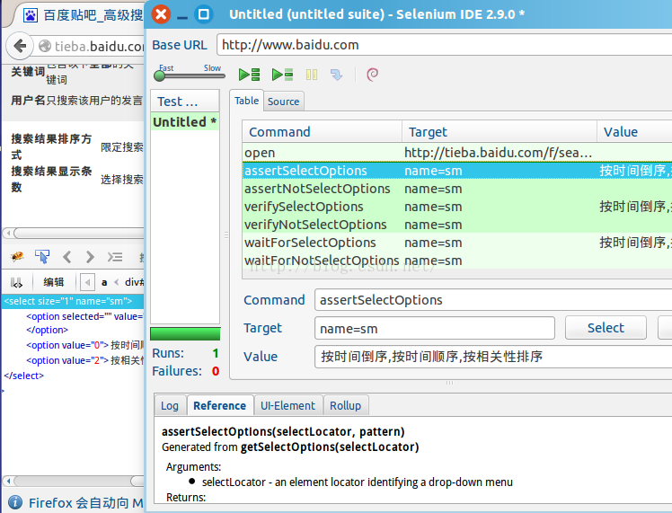

## 11.assertTable( tableCellAddress , pattern ) / assertNotTable( tableCellAddress , pattern ) / verifyTable( tableCellAddress , pattern ) / verifyNotTable( tableCellAddress , pattern ) / waitForTable( tableCellAddress , pattern ) / waitForNotTable( tableCellAddress , pattern ) 

    （1）作用：验证表格（table元素）中某个单元格（td元素）的值是否为预期值；
 
    （2）Target-格式为“表格的定位表达式.行号.列号”，如“foo.1.4”；

    （3）Value-用于对比的预期值；

如：验证百度首页“百度一下”的value属性是否为“百度一下”：

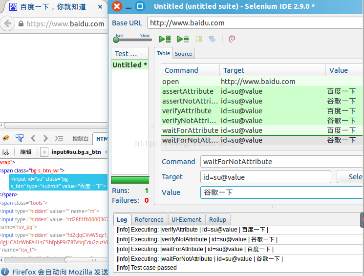

## 13.assertTextPresent ( pattern ) / assertNotTextPresent ( pattern ) / verityTextPresent ( pattern ) / verityNotTextPresent ( pattern ) / waitForTextPresent ( pattern ) / waitForNotTextPresent ( pattern ) 

    （1）作用：验证指定的文本是否在页面中出现；

    （2）Target-用于对比的预期文本；

  如：验证百度首页是否出现“hao12”的文本：

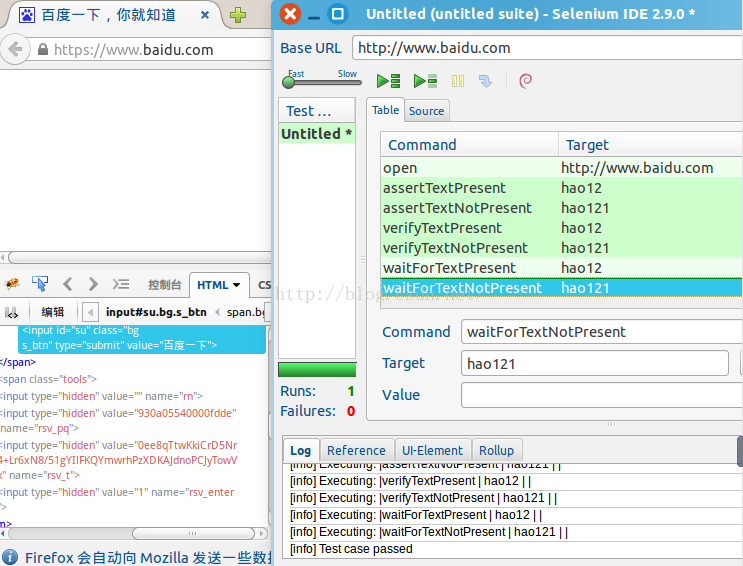

## 14.assertElementPresent ( locator ) / assertElementNotPresent ( locator ) / verifyElementPresent ( locator ) / verifyElementNotPresent ( locator ) / waitForElementPresent ( locator ) / waitForElementNotPresent ( locator ) 

    （1）作用：验证指定元素是否存在于页面上；

    （2）Target-元素的定位表达式；

  如：验证百度首页“百度一下”的按钮是否存在：

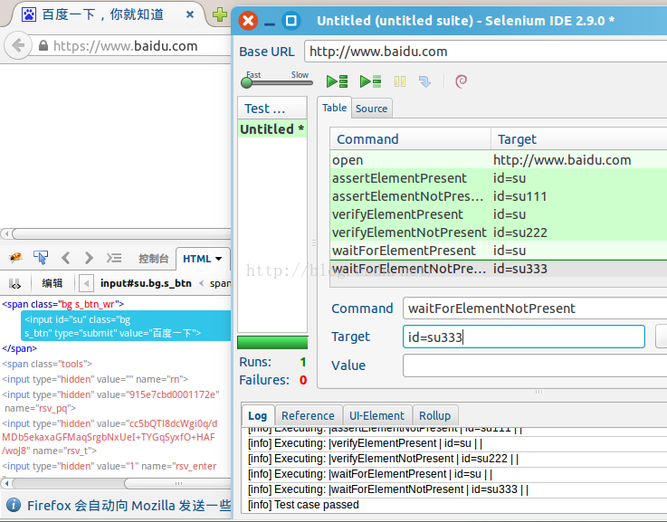

## 15.assertVisible ( locator ) / assertNotVisible ( locator ) / verifyVisible ( locator ) / verifyNotVisible ( locator ) / waitForVisible ( locator ) / waitForNotVisible ( locator ) 

    （1）作用：验证页面中是否显示指定元素；
 
    （2）Target-元素的定位表达式；

