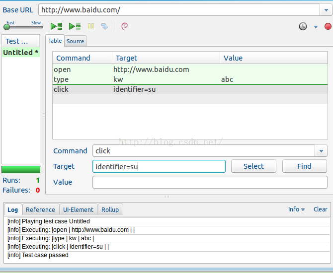
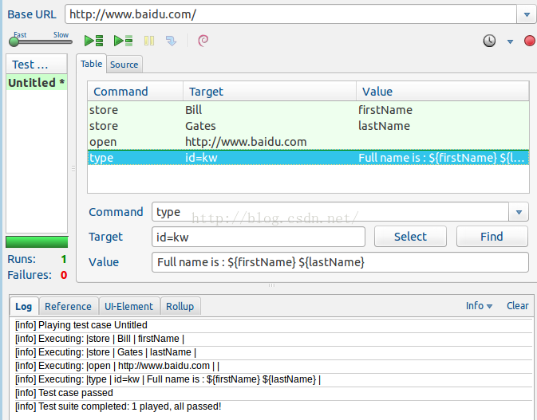
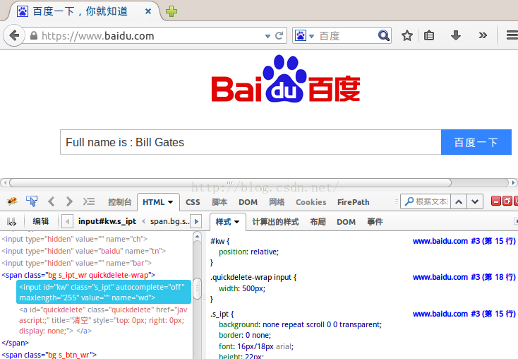
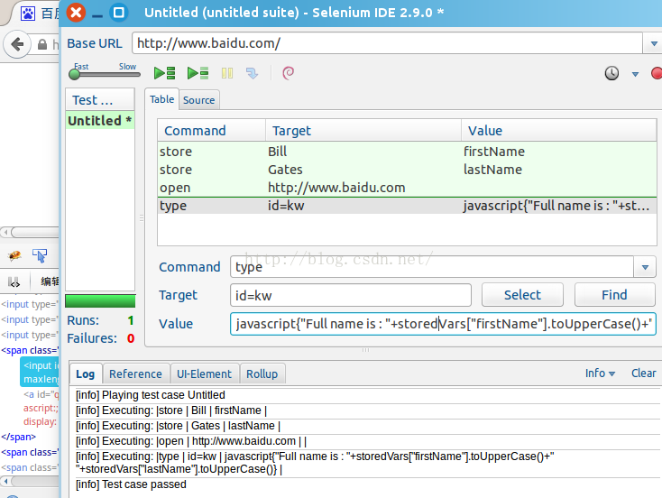
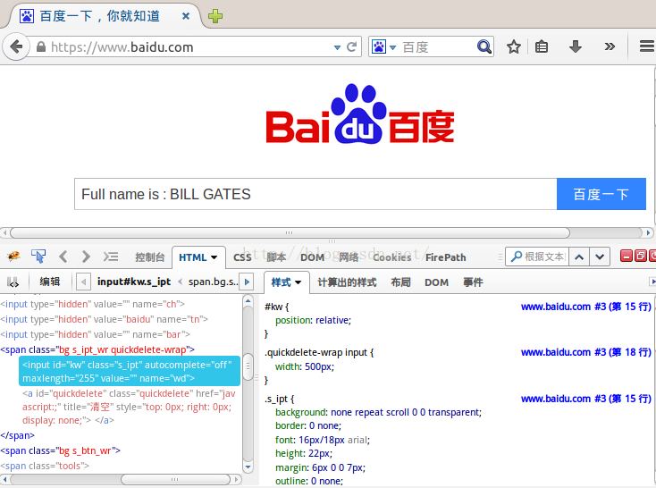

# 一.Target

## 1.identifier定位

    （1）若没有定位类型，此为一种默认的定位方式；

    （2）IDE会首先寻找首个id属性=定位值的页面元素；若未找到id属性，接下来会寻找首个name属性=定位值的页面元素；若仍未找到，则定位失败；
如：



## 2.id定位

    （1）比identifier定位方式的搜索范围更精细具体；

## 3.name定位

    （1）此定位方式将会识别首个name属性为定位值的页面元素；

    （2）若有多个元素的name属性都相同，则可以使用过滤器来进一步细化定位（默认过滤器类型是value属性）；


## 4.XPath定位

    （1）当找不到合适的id或name属性来定位元素时，XPath派上用场，可通过元素绝对路径（不推荐）/相对路径，也可像之前使用id或name属性，或其他任何属性来定位；

    （2）如果XPath表达式以“//”开头，那么在使用XPath定位时无须再包含“xpath=”了；

    （3）具体详见http://blog.csdn.net/grace666/article/details/46481919；


## 5.链接文字定位

    （1）只需提供链接文本就可以定位到对应的链接；

    （2）若存在两个链接的文本相同，则会匹配第一个；

  如：
```html
 <html>
 <span style="font-family:Microsoft YaHei;">1 <html>  
<body>  
<p>Are you sure you want to do this?</p>  
 <a href="continue.html">Continue</a>  
<a href="cancel.html">Cancel</a>  
 </body> 
</span> 
 <html>  
```

    link=Continue，将返回第4行代码中的元素；

    link=Cancel，将返回第5行代码中的元素；

## 6.DOM定位

    （1）可通过JavaScript进行访问；

    （2）该定位方式需要JS来计算出元素在页面上的位置，通过分级符号（.）可轻松定位；

    （3）由于DOM定位才会在开头使用“documen”，所以没必要再写“dom=”；

  如：

```html
<html> 
<span style="font-family:Microsoft YaHei;">1 <html>  
 <body>  
 <form id="loginForm">  
  <input name="username" type="text"/>  
  <input name="password" type="password"/>  
  <input name="continue" type="submit" value="Login" />  
   <input name="continue" type="button" value="Clear" />  
 </form>  
</body> 
</span> 
</html>  
```
    dom=document.getElementById('loginForm')，将返回第3行代码中的元素；

    dom=document.forms['loginForm']，将返回第3行代码中的元素；

    dom=document.forms[0]，将返回第3行代码中的元素；

    document.forms[0].username，将返回第4行代码中的元素；

    document.forms[0].elements['username']，将返回第4行代码中的元素；

    document.forms[0].elements[0]，将返回第4行代码中的元素；

    document.forms[0].elements[3]，将返回第7行代码中的元素；

# 7.CSS定位

    （1）使用选择器来为文档中的元素绑定样式属性，可用在selenium中；

    （2）"id"对应"#","class"对应"." .id是唯一标志的，在同一页面中不能有相同的值,class则没这约束；

  如：
```html
<html> 
<span style="font-family:Microsoft YaHei;">1 <html>  
 <body>  
 <form id="loginForm">  
  <input class="required" name="username" type="text"/>  
 <input class="required passfield" name="password" type="password"/>  
  <input name="continue" type="submit" value="Login"/>  
 <input name="continue" type="button" value="Clear"/>  
 </form> 
</body> 
</span> 
<html>  
```
     css=form#loginForm，将返回第3行代码中的元素；

     css=input[name="username"]，将返回第4行中的元素；

    css=input.required[type="text"]，将返回代码中第4行的元素；

    css=input.passfield，将返回第5行代码中的元素；

    css=#loginForm input[type="button"]，将返回第7行代码中的元素；

    css=#loginForm input:nth-child，将返回第5行代码中的元素；

# 8.隐式定位

    （1）Target表达式没有指定明确的定位方式时，将默认使用indentifier定位；

    （2）如果Target表达式以“//”开头，则会使用XPath定位；

    （3）如果Target表达式以“document”开头，则会使用DOM定位。


# 二.Value

## 1.带变量的字符串

如：假设要填写某个值到百度搜索框，但这个值由两个变量组成：firstName（值为Bill）和lastName（值为Gates），然后将这两个变量组合

在一起填写到百度搜索框，则对应如下:



 执行结果如下：



## 2.带JavaScript的字符串

如：假设要填写某个值到百度搜索框，但这个值仍由两个变量组成：firstName（值为Bill）和lastName（值为Gates），然后将这两个变量组

合在一起填写到百度搜索框，但要将firstName和lastName转换为大写，则对应如下：



 执行结果如下图：


